[<h3>Retour au docs</h3>](../README.md#matériaux-compréssés)

**Recettes:**

>### Charbon compréssé:
>*Utilité: Carburant*
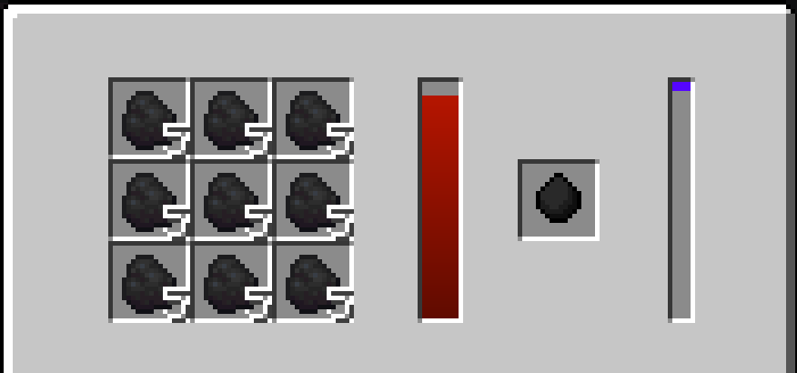
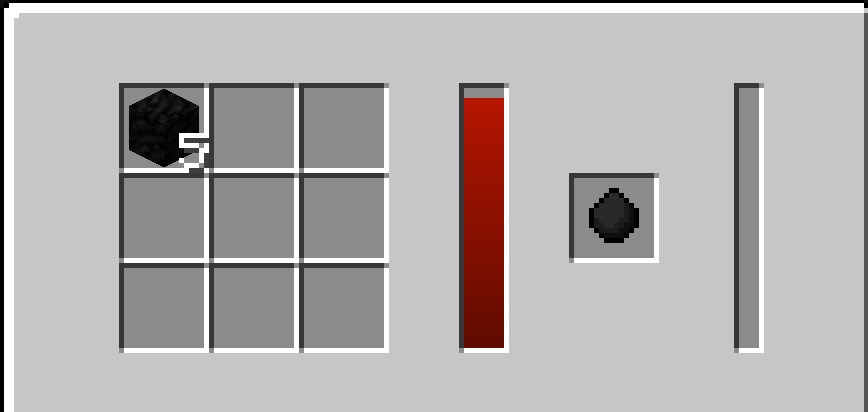

>### Acier compréssé:
>*Utilité: Materiel*
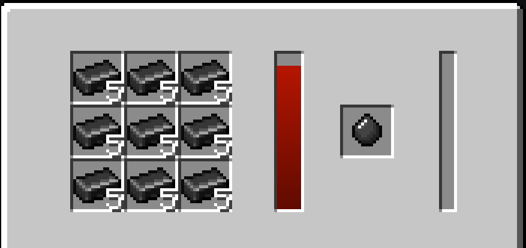
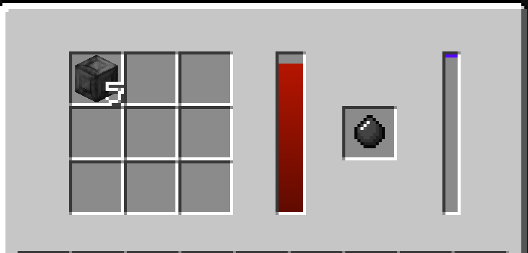

>### Diamant compréssé:
>*Utilité: Materiel*
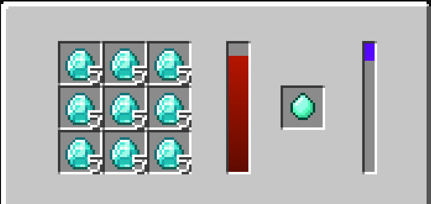
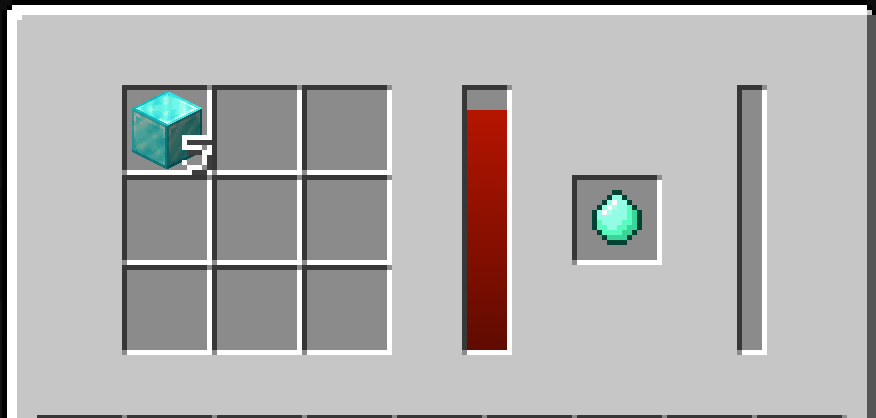

>### Emeraude compréssé:
>*Utilité: Materiel*
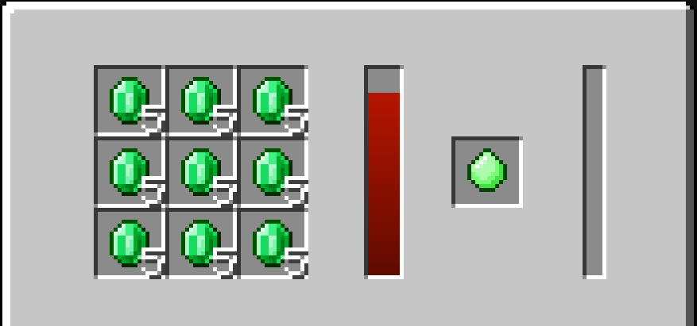
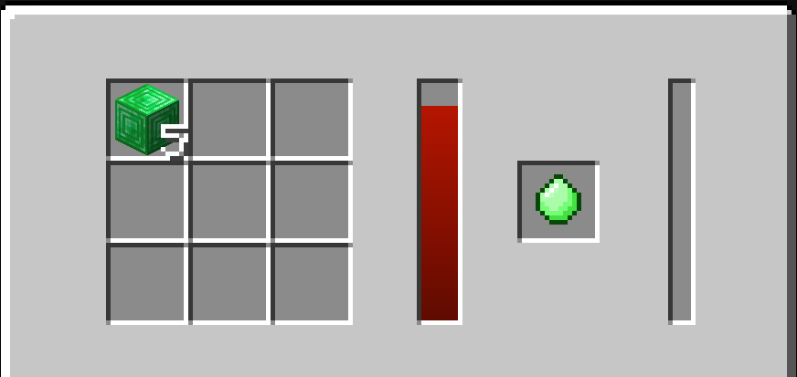

>### Netherite compréssé:
>*Utilité: Materiel*
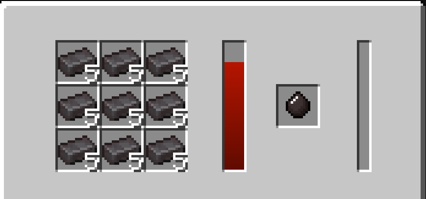
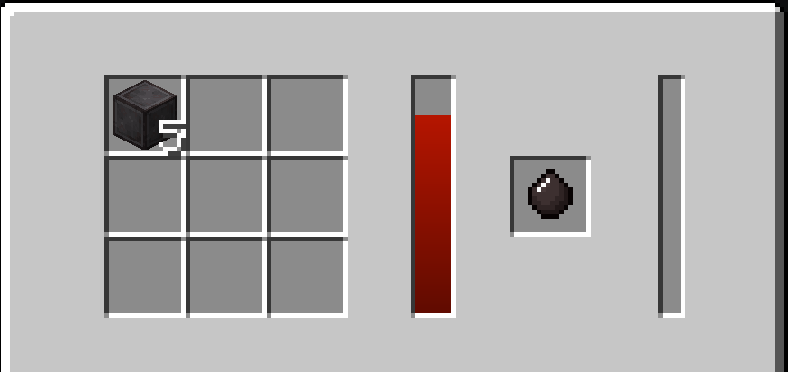

>### Titane compréssé:
>*Utilité: Materiel*
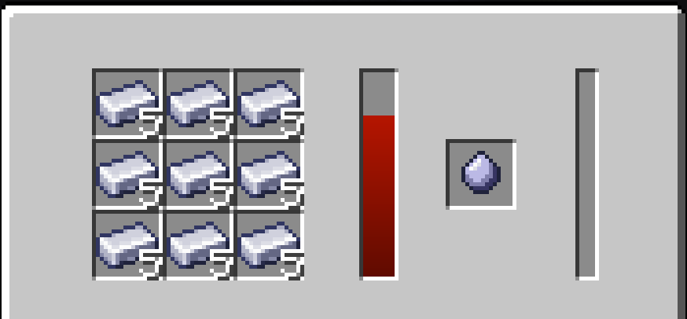
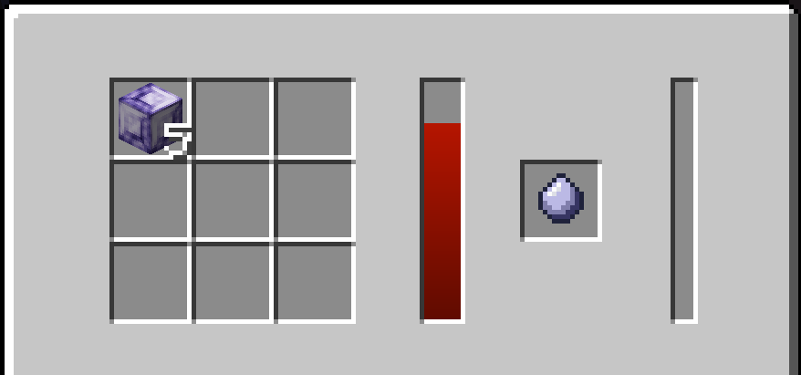