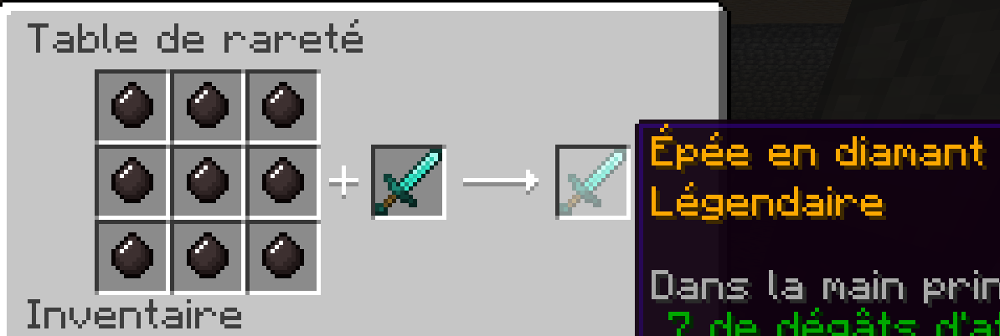

### [Retour au docs](../README.md#table-de-rareté)

## **Recettes:**

> ### Commun -> Peu commun
>
>

> ### Peu commun -> Rare
>
>

> ### Rare -> Très rare

>
>

> ### Très rare -> Légendaire
>
>

> ### Légendaire -> Mythique 
>
>
