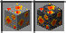
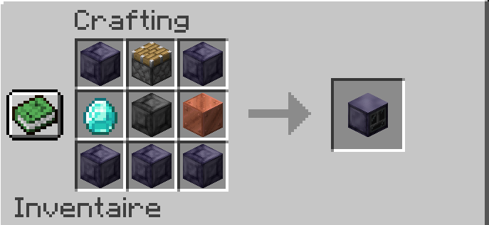
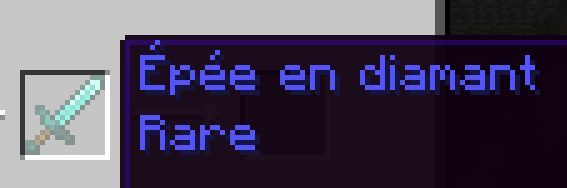
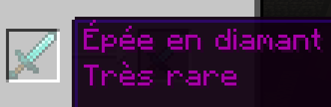

#   RPGMod 
## Items ajoutés
---
### Matériaux :
> #### Lingot d'acier
> *Utilitée: Materiel*
>##### **Recettes:**
>
> 

> #### Lingot de titane
> *Utilitée: Materiel*
> ##### **Recettes:**
> 
>  

> #### Lingot de titane renforcé
> *Utilitée: Materiel*
> ##### **Recettes:**
> 
>  

> #### Matériaux compréssés
> [**Recettes**](Docs/MateriauxCompresses.md)

 ### Outils:

> #### Outils en cuivre
> *Utilitée: Outils*
> [**Recettes**](Docs/OutilsEnCuivre.md)

> #### Outils en acier
> *Utilitée: Outils*
> [**Recettes**](Docs/OutilsEnAcier.md)

> #### Outils en titane
> *Utilitée: Outils*
> [**Recettes**](Docs/OutilsEnTitane.md)

> #### Outils en titane renforcé
> *Utilitée: Outils*
> [**Recettes**](Docs/OutilsEnTitaneRenforce.md)

### Épées spéciales
#### Épées élémentaires
*Font des dégats élémentaires aux mobs. Si le mob est résistant a l'élément, il ne va pas ressentir les effets. Si il est vulnérable, il ressentira soit des effets supplémentaires, soit l'effet sera amplifié*
>##### Épée de feu
> *Brule les ennemis.*
> ##### **Recette:**
>
>* Utilise le [compresseur a item](#compresseur-a-item)*
    
>##### Épée de glace
>*Gèle les ennemis sur place. Fait des dégats a ceux vulnérable.* 
>##### **Recette:**
>
>* Utilise le [compresseur a item](#compresseur-a-item)*

>##### Épée de poison
>*Empoisonne les ennemis d'un venim mortel.*
>##### **Recette:**
>
>* Utilise le [compresseur a item](#compresseur-a-item)*
#### Marteau de thor
*Épée elementaire spéciale. (Pas de recette pour l'instant)*  

Élement: Éclair
> Fait apparaitre des eclairs sur le mob a chaque 7 Ticks.

> Sur clique droit, fait apparaitre des eclairs sur un rayon de 8 blocs autour du joueur. 
#### Épées multi-élémentaires
*Épées ayant plusieurs éléments. (Pas de recette pour l'instant)*

>##### **Épée de l'enfer**
>*Élements:*
>- Poison
>- Feu

>##### **Épée de dieu**
>*Élements:*
>- Poison
>- Feu
>- Glace
>- Éclair

## Blocs Ajoutés
---
### Minerais

*Deux variations: En pierre et en profondoise. Aucune difference autre que le bloc qui drop. Non-craftable.*
> #### Titane
>
>  Outil requis: **Pioche**
>  Materiel requis: Diamant
>  Drop: 1x Minerai de titane

> #### Cristal de feu
>
>  Outil requis: **Pioche**
>  Materiel requis: Titane renforcé
>  Drop: 1-3x crystal de feu

> #### Cristal de glace
>
>  Outil requis: **Pioche**
>  Materiel requis: Titane renforcé
>  Drop: 1-3x crystal de glace

> #### Cristal de poison
>
>  Outil requis: **Pioche**
>  Materiel requis: Titane renforcé
>  Drop: 1-3x crystal de poison

> #### Multi cristal
>
>  Outil requis: **Pioche**
>  Materiel requis: Titane renforcé
>  Drops: 
>- 1-3x crystal de feu
>- 0-2x crystal de glace
>- 0-2x crystal de poison

### Blocs de métaux

*Blocs craftables fait avec des lingots.*
#### **[Recettes](Docs/BlocsDeMetaux.md)**

>#### Bloc d'acier
>
>  Outil requis: **Pioche**
>  Materiel requis: Cuivre

>#### Bloc de titane
>
>  Outil requis: **Pioche**
>  Materiel requis: Diamant

>#### Bloc de titane renforcé
>
>  Outil requis: **Pioche**
>  Materiel requis: Titane renforcé

### Compresseur a item
>
>  Outil requis: **Pioche**
>  Materiel requis: Titane renforcé
 >#### **Recette:**
 >

#### Fonctionnalité:
*Combine n items selon une recette. Les recettes prennent soit les 9 slots disponnibles, soit un seul. Peut prendre de 1-64 items par slot. Requiere de l'énergie pour rouler. Prends 200FE d'énergie par seconde. La capacité maximale est de 60,000 FE et peut etre rechargé grâce a du carburant.*

#### Carburants acceptés:
>- Charbon (+10FE)
>- Charbon de bois (+15FE)
>- Bloc de charbon (+95FE)
>- Charbon compressé (+2000FE)
>- Seau de lave (+300FE)

### Table de rareté
>
>  Outil requis: **Pioche**
>  Materiel requis: Titane renforcé
 >#### **Recette:**
 >

#### Fonctionnalité:
*Permet d'augmenter la [rareté](#système-de-raretée) d'un item. Suit une recette. La recette suit un pattern d'item seul les pattern de 3x3 sont acceptés, mais tout les items peuvent etre differents. Prends un item ayant déja une rareté, puis l'augmente de un niveau, jusqu'au niveau 5 (Mythique) maximum.*

[**Recettes**](Docs/RecettesTableRarete.md)

## Mécaniques
---
### Mécanique de soif
  

>*Ajoute une barre de soif. Donne des bonus quand la barre est pleine. A la moitié, le bonus est réduit, puis a partir de 20% le bonus est enlevé. Pour augmenter la barre de soif il suffit de boire des potions ou des bouteilles d'eau.*
### Indicateur de dommage
 

>*Système simple qui montre la vie restante d'un mob sur la vie totale.*
## Système de raretée
---
### Fonctionalité:
*Permet de donner des bonus sur les items. 7 niveaux, de commun jusqu'a divin. Plus le niveau est haut, plus les bonus sont hauts.*

### Raretés:
> Commun (Niveau 0)
>
>

> Peu commun (Niveau 1)
>
>

> Rare (Niveau 2)
>
>

> Très rare (Niveau 3)
>
>

> Légendaire (Niveau 4)
>
>

> Mythique (Niveau 5)
>
>

> Divine (Niveau 6)
>
>

## Système de compétence 
---
### Minage
*À chaque bloc miné par une pioche, une quantité d'xp de minage est gagnée. L'xp varie selon le bloc qui est miné dépendant de sa difficulté a miner ainsi que de sa raretée. Après une certaine quantité d'xp accumulé, le niveau de minage augmente. Le pallier pour les niveaux augmente a chaque niveau par un certain pourcentage. A tout les quelques level up, un bonus est appliqué.*

>#### Liste des bonus:
>- Tout les 2 niveaux: Le joueur recoit un point de vie en plus
>- Tout les 10 niveaux: Vitesse de minage amélioré

### Buchage
*À chaque bloc miné par une hache, une quantité d'xp de buchage est gagnée. L'xp varie selon le bloc qui est miné dépendant de si c'est une buche, une planche ou un bloc quelquoncque. Après une certaine quantité d'xp accumulé, le niveau de buchage augmente. Le pallier pour les niveaux augmente a chaque niveau par un certain pourcentage. A tout les quelques level up, un bonus est appliqué.*

>#### Liste des bonus:
>- Tout les 3 niveaux: Le joueur fait plus de dégat d'attaque
>- Tout les 8 niveaux: Jusqu'au niveau 24, le joueur reçoit de le résistance au dégats. A partir du niveau 32, le joueur reçoit un bonus de saut. 
### Attaque
*À chaque entité par une épée, une quantité d'xp d'attaque est gagnée. L'xp varie selon le type d'entité qui est tué. Après une certaine quantité d'xp accumulé, le niveau de minage augmente. Le pallier pour les niveaux augmente a chaque niveau par un certain pourcentage. A tout les quelques level up, un bonus est appliqué.*

>#### Types d'entités:
>- Inoffensif: Ne fait pas de dégat au joueur
>- Nocif: Peu faire un peu de dégat au joueur / le tuer
>- Dangeureux: Grande chance de tuer le joueur si il n'est pas équipé
>- Très dangeureux: Grande chance de tuer le joueur même s'il est bien équipé
>- Boss: Un des boss du jeu. Necessite de l'équipement très avancé pour battre.

>#### Liste des bonus:
>- Tout les 3 niveaux: Le joueur recoit de la resistance au recul
>- Tout les 10 niveaux: Jusqu'au niveau 20, le joueur recoit un bonus de regeneration. A partir du niveau 30, le joueur recoit un bonus de force.
>- Au niveau 30: Le joueur est totalement résistant au feu
>- Au niveau 35: Le joueur peut voir dans le noir

## Système de classe
---
### Fonctionalité:
*Les classes permettent au joueur de réduire le temps pour améliorer une certaine compétence. A chaque action qui donne de l'xp de compétence, de l'xp de classe est donné. A chaque niveau de classe obtenu, l'xp de compétence est multiplié par le niveau de la classe.* 
>#### Interface:
>

### Classes:

> #### Mineur
>Compétence: Minage
> À chaque bloc miné avec une pioche, l'xp de classe est augmenté de 100.

> #### Bucheron
>Compétence: Buchage
> À chaque bloc miné avec une hache, l'xp de classe est augmenté de 100.

> #### Soldat
>Compétence: Attaque
> À chaque entité tuée avec une épée, l'xp de classe est augmenté de 100.
